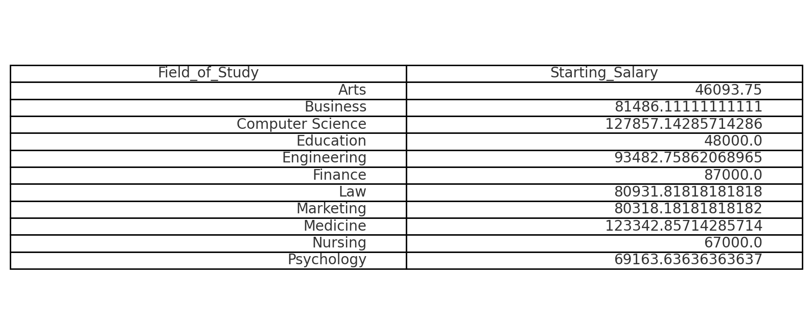
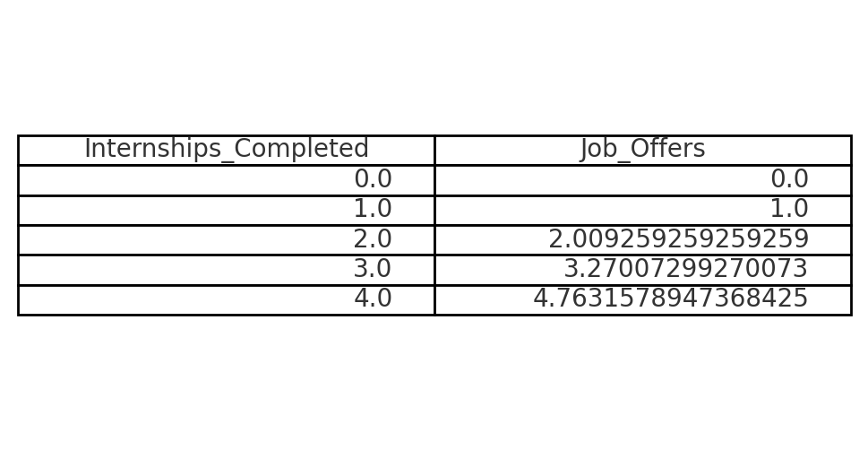
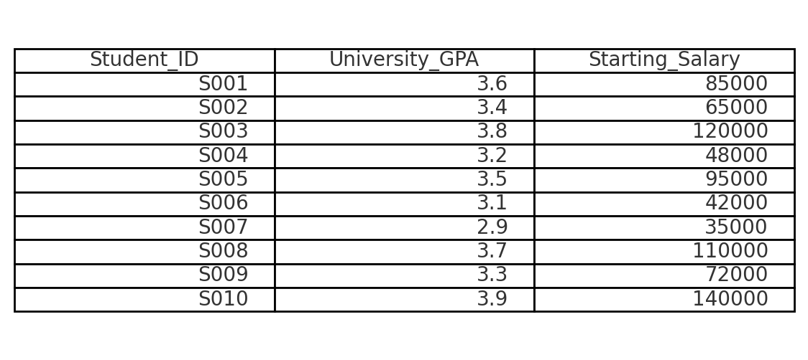
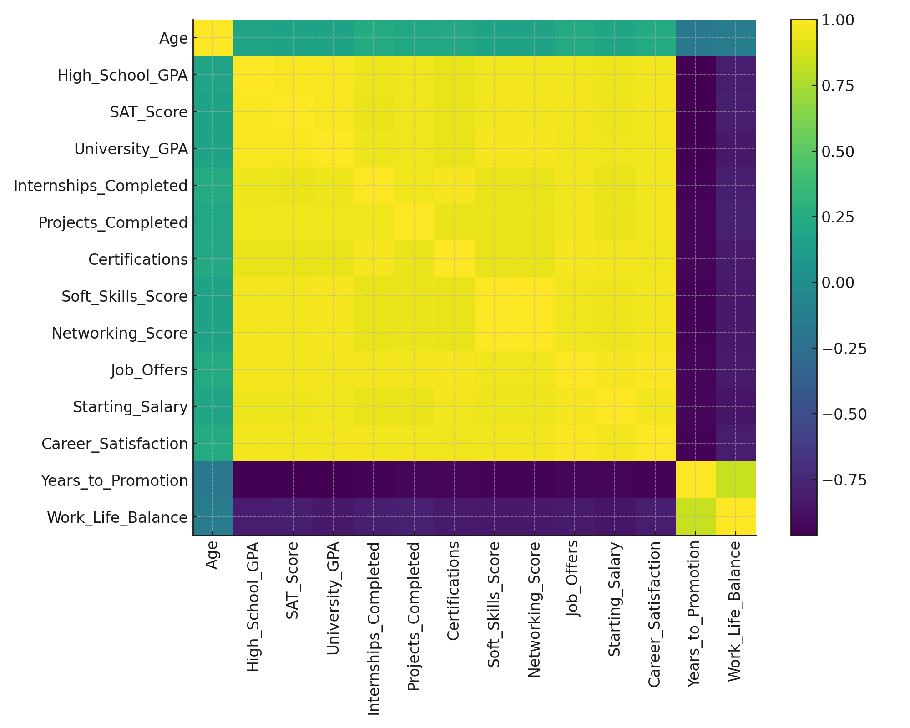
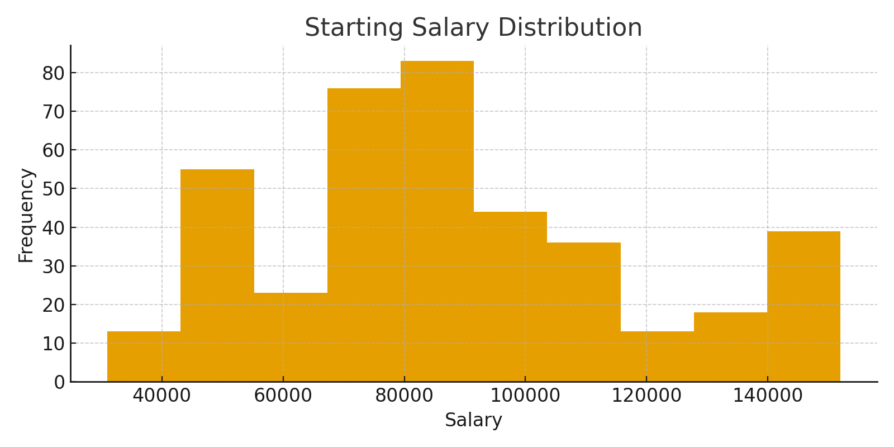
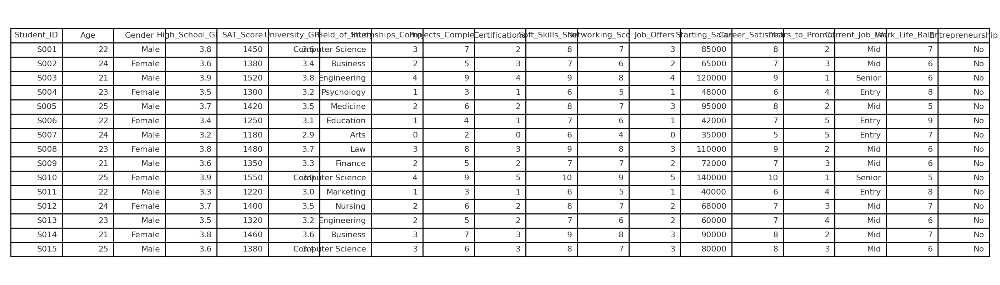
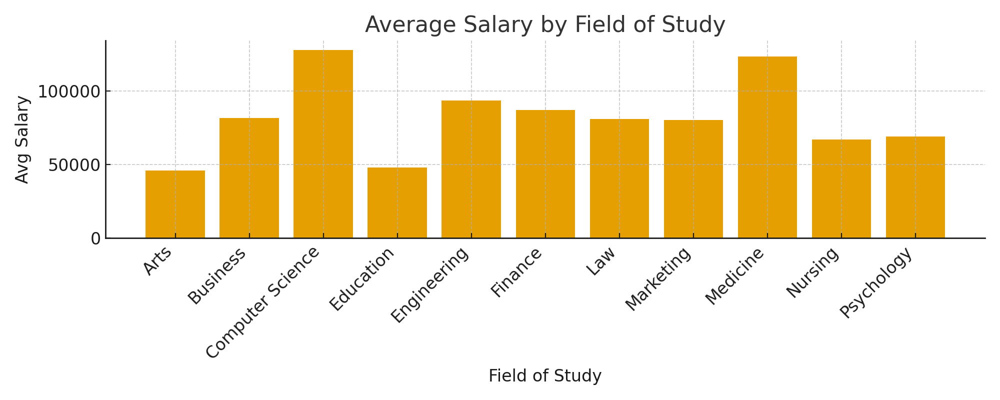

# 🎓 Education to Career Success – SQL Analytics Project

**Author:** Kalpana Kumari Medapati  
**Target roles:** Data Analyst / BI Analyst / Junior Data Scientist  

---

## 📌 Project Overview

This project explores how education, skills, and early career experiences influence **career outcomes** such as starting salary, job offers, promotion speed, and satisfaction.

Using a synthetic dataset (`education_career_success.csv`), I designed a **relational database**, loaded the data via a staging process, and wrote **analytical SQL queries** to generate actionable insights.

---

## 🎯 Business Questions

- Do **higher GPAs** lead to **higher starting salaries**?
- How do **internships, projects, and certifications** affect the **number of job offers**?
- Does **networking** or **soft skills** impact **promotion speed**?
- Which **fields of study** have the **highest salary and satisfaction**?
- How do **work–life balance** and job level relate to **career satisfaction**?

---

## 🛠️ Tech Stack

- SQL (MySQL / PostgreSQL / SQL Server)
- Relational database design
- Staging → normalized tables
- GitHub for version control

---

## 🧱 Data Model

The original CSV includes:

- academic performance (GPA, SAT)
- experience (internships, projects, certifications)
- skills (soft skills, networking)
- career outcomes (job offers, salary, promotions, job level, satisfaction)

To make analysis cleaner and scalable, I normalized the data into 5 main tables:

- `Student` – demographics & field of study  
- `AcademicPerformance` – high school GPA, SAT, university GPA  
- `Experience` – internships, projects, certifications  
- `Skills` – soft skills and networking score  
- `CareerOutcome` – job offers, salary, promotion speed, job level, work–life balance, satisfaction  

📁 See `/erd-diagrams/education_career_success_erd.png` for the Crow’s Foot ERD.

---

## 🗄️ Implementation

### 1. Table Creation (DDL)

All `CREATE TABLE` scripts are in:

- `/sql-ddl/create_tables.sql`
- `/sql-ddl/create_staging.sql`

### 2. Data Loading

1. Load the CSV into a **staging table** `Staging_EducationCareer`.
2. Insert from staging into normalized tables using:

- `/sql-dml/load_staging.sql`
- `/sql-dml/insert_from_staging.sql`

---

## 📊 Analytical SQL Queries

Key analysis scripts are in:

- `/sql-analytics/analysis.sql`

Example insights:

- **Starting salary by field of study**  
- Impact of **internships** on **job offers**  
- Salary trends by **university GPA band**  
- Effect of **networking score** on **years to promotion**  
- Relationship between **work–life balance** and **career satisfaction**  

---

## ✅ Skills Demonstrated

- Relational database design & normalization  
- Staging → warehouse loading pattern  
- Writing clean, readable SQL  
- Answering real business questions with data  
- Preparing a portfolio-ready analytics project

---
### 📊 Example Results

#### Average Salary by Field

#### Internships vs Job Offers

#### GPA vs Salary Sample

### 🔥 Correlation Heatmap

### 💰 Salary Distribution

### 📄 Sample SQL Output

### 📊 Avg Salary by Field of Study

## 🚀 Next Steps

This project will be extended into:

- A **Power BI / Tableau dashboard** using the same dataset  
- A **machine learning model** to predict starting salary and/or job offers  

